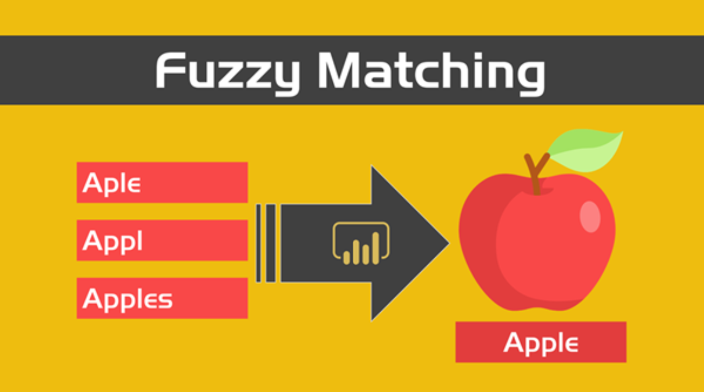
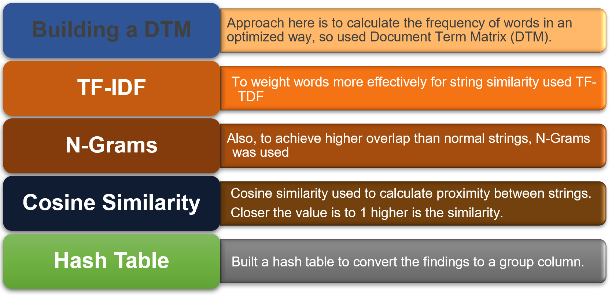

<h1 align="center">Fuzzy Utlity Engine with Active Learning</h1>

#### Abstract
Currently, we are consuming KYC information of our customers digitally, from walk-in customers and over phone calls. All these data populate in our pulse tool. However, it has been observed that the current system is not able to dedupe similar customers, which results in creating different personas for the same Individual. Other probable challenges were Inaccurate Insights, Untagged accounts, and Lack of integrity. To address this problem, I have created a fuzzy utility engine that can dedupe names based on various KYC information. The fuzzy algorithm works on a vector formed using the customer name and its feature set. Finally, to test the algorithm accuracy of the model, we initially went with manual testing. Subsequently, used that sample to automatedly annotate False positives using a classification model where we applied an active learning feedback approach to improving the model accuracy in real-time. 

I achieved an accuracy of 95% with a False positive rate of 5% and False negative rate of 0.2 from the baseline model where the algorithm ran on the single column. The baseline line model has an accuracy of 64% with greater than 30% false positive rate. Also, the active learning XGB classifier model achieves 98% accuracy.

#### Research
Initially, I thought the deduping problem would only contain spelling errors, for instance, Katya/katiyaa. However, after doing my research, considering that data is getting collected over calls and using physical platforms, I found many use cases of similarity between names. Some of the use cases I mentioned below:

The persona matching engine targeted 9 types of problems, which falls in the fuzzy matching realm.
1.	Textual Similarity (typos, etc.)
2.	Nickname (Mike/Michael)
3.	Missing spaces/hyphens (Mary Ellen/MaryEllen/Marry-Ellen)
4.	Initials (JE Smith/James Earl Smith)
5.	Out of order components (Diaz Carlos Alfonzo/Carlos Alfonzo Diaz)
6.  Name Split (First: Dick, Last: Van Dyke/First: Dick Van, Last: Dyke)
7.	Truncated Name (Charles Livingston/Charles Living)
8.	Missing Name (John Albert Lewis Lewis/John Lewis)
9.	Maiden name addition (or any other additional last name)

#### Future coverage
Two problems that we found of less importance for our system and can be covered in future are:
-   Name Swap (Bene Tyler/Tyler Bene)
-   Phonetics Similarity

#### Model Algorithm
The goal is to build a algorithm which can be scalable enough to run millions of records. Below are the building blocks of the algorithm

-   **Building a document term matrix**: As we have millions of records, and the algorithm has to run within a single spreadsheet, thus each record has to be compared with its adjacent entry. For instance, for every 100 k records, the calculation has to be made for $100^2$ k.
    Because of this reason, I went with matrix multiplication, a dynamic algorithmic approach to making a faster calculation.

-   **Applying TF-IDF**: The most common approach would be word count, but it will not be able to capture the word importance. Therefore, I decided to go with TF-IDF. It will multiply the number of times a term appears in a single document(Term Frequency) by the significance of the whole corpus. The more the word appears, the less valuable it becomes to differentiate documents from one another.

-   **N-Grams**: To make the TF-IDF more significant, I used N-grams to break the strings into smaller chunks. For our model, the n-gram of 3 is the right hyperparameter. After applying n-grams, I found significantly more overlap than the original string. 

